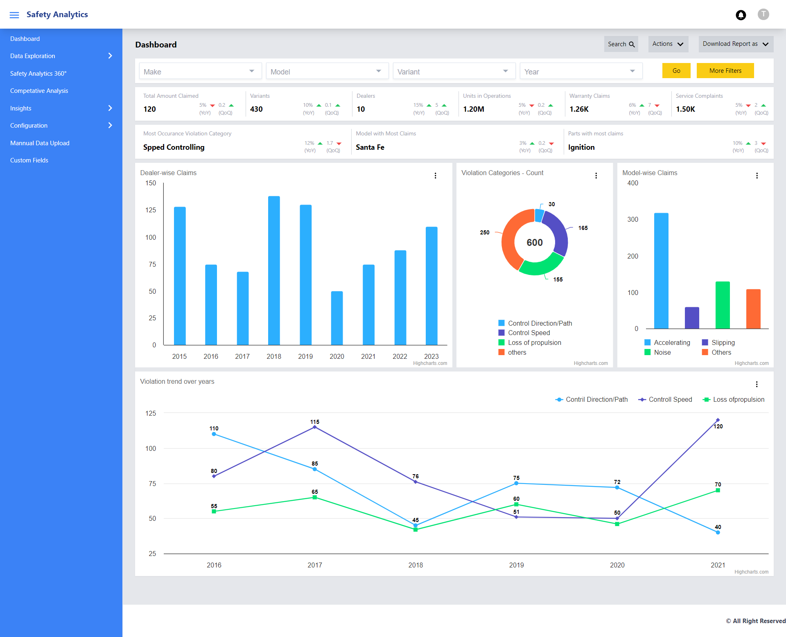
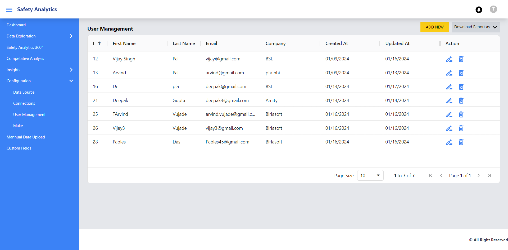
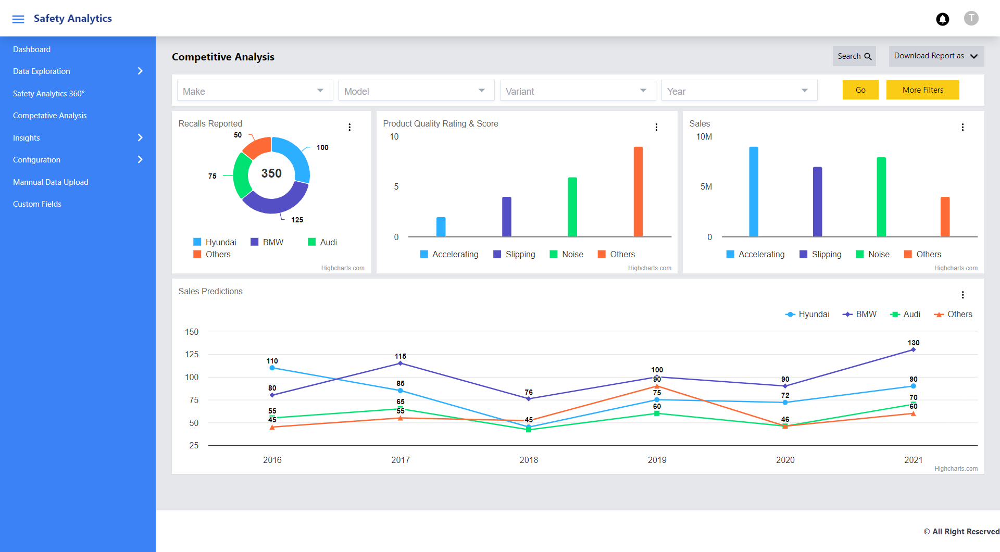
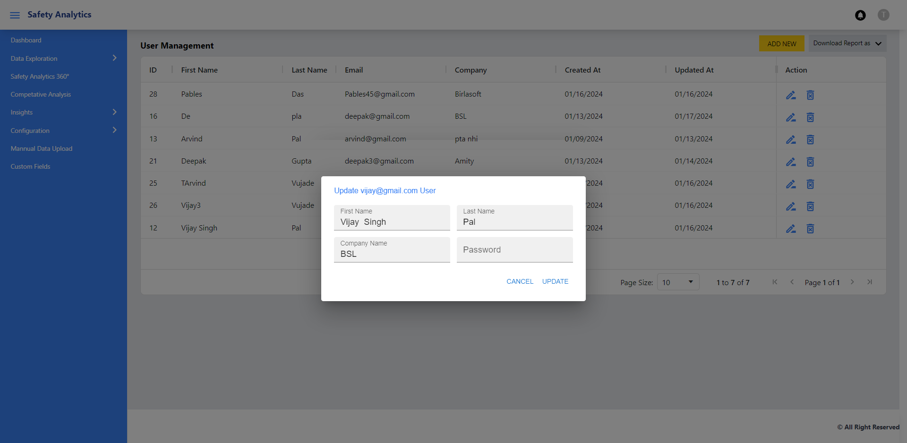
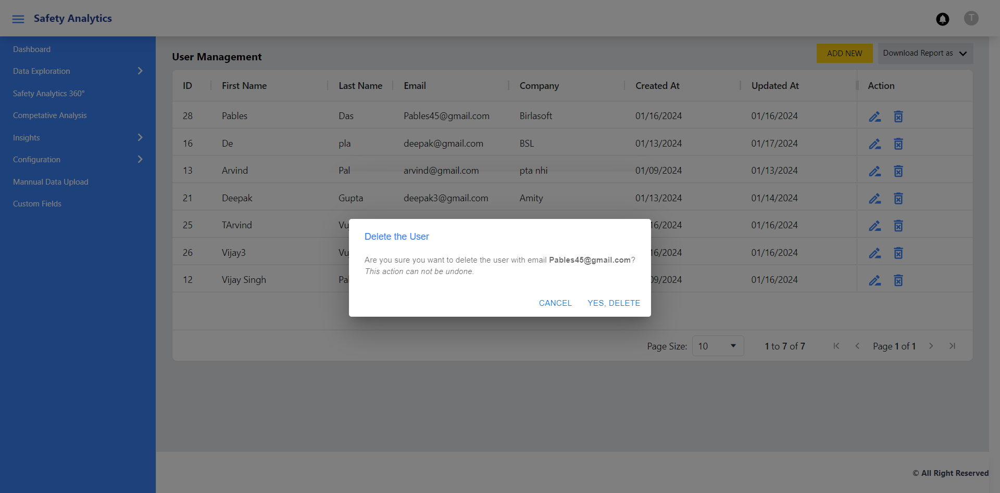

# Getting Started with Create React App

This project was bootstrapped with [Create React App](https://github.com/facebook/create-react-app).

## Available Scripts

In the project directory, you can run:

### `npm start`

Runs the app in the development mode.\
Open [http://localhost:3003](http://localhost:3003) to view it in the browser.

The page will reload if you make edits.\
You will also see any lint errors in the console.

Applications Screenshots

1. Login Page
   

2. Dashboard
   

3. User Management
   

4. Competetive Analysis
   

5. User Update
   

6. User Delete Confirmation
   
